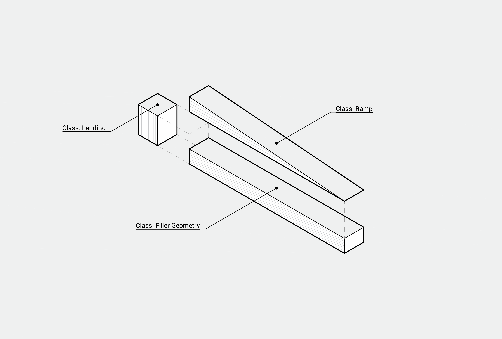

# Accessible Ramp Calculator

## The Project

The main idea of this project started from a need of always checking how long a ramp should be for a height of ‘x’.

> [!NOTE]
> How to calculate a ramp lenght or inclination
> $$i=h/d * 100$$
> * Where:
>    * $i$ -  is the inclination, in percentage
>    * $h$ - is the height of the ramp
>    * $d$ - is the distance of the ramp

In construction, a ramp is defined as an slope of the floor surface, longitudinal to the direction of travel, with a slope equal to or greater than 5%. Its presence can be encountered in multiple spaces, serving as a way for those who lack mobility and, in order to it be adequate to its purpose, multiple standards were developed, being the most important, in Brazil, the standard ABNT NBR 9050:2020.

The standard defines parameters that guide and help Architects and Engineers with projecting and constructing accessible spaces. In this project, the scope was only the parameters related to ramps, such as inclination, maximum allowed height between landings and maximum number of segments for each inclination. As a representation of a real object, a virtual object could have infinite attributes trying to mimic a real world characteristic, so the first focus of development was to create an object that could receive, as input, an height, a width and a desired slope for calculating the necessary length, and making all the necessary adequation as inserting landings in intervals of height.

## Start of the idea

To start the development, the geometry of a simple version of a ramp was selected and divided in three parts or classes. 

Those three simple geometries compose a linear ramp.

After defining the approach to perspect the object, the base syntax and first variables of each class was written and, a need for a base class was observed to deal with common ideas, such as, the area and volume of the object. So the additional Geometry class was created with only the basic attributes to generate basic information about an accessible ramp.

## Classes

The code consists of 5 classes and the additional data class Limits to store the limits defined for each slope in the standard.

* [Limits](https://github.com/matheusfarnetani/cs50p_project/blob/main/models/limits.py)
* [Accessible Ramp](https://github.com/matheusfarnetani/cs50p_project/blob/main/models/accessible_ramp.py)
* [Filler](https://github.com/matheusfarnetani/cs50p_project/blob/main/models/filler.py)
* [Geometry](https://github.com/matheusfarnetani/cs50p_project/blob/main/models/geometry.py)
* [Landing](https://github.com/matheusfarnetani/cs50p_project/blob/main/models/landing.py)
* [Ramp](https://github.com/matheusfarnetani/cs50p_project/blob/main/models/ramp.py)

## Code Diagram

The modularity resulting from the idea of dividing the object into micro objects allows for implementation of multiple functionality and creativity. The main path is through the initialization of an AccessibleRamp class. Through this way, the code will calculate and execute every step in order to create a list, called map, containing only one ramp or a combination of ramps, landings and fillers used to calculate the total values of this accessible ramp and, perhaps, in a future help develop the functionality of specifying other form than linear.

## Files
### /project.py
The “/project.py” file displays some possible uses of the object as, for example, calculating the maximum allowed height that a slope can achieve and the maximum allowed slope that can be used to achieve determined height

### /test_project.py
The “/test_project.py” file was written utilizing the library Pytest to check if the functionality written in “/project.py” behaves as expected.

### /tests/
This folder contains initialization tests for each model. All models functions should be rewritten to return values, in order to be tested

### /models/
This folder contains the classes declaration, or models, develop for this project